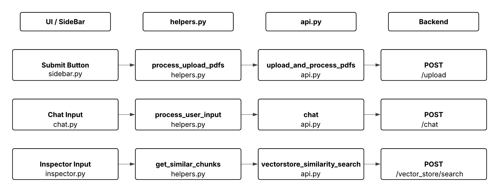

# RAG BOT - Client

This is the Streamlit-based frontend for the RAG Bot. It allows users to upload PDF files, ask questions, inspect responses, and download chat history.

---

## Project Structure

```
client/
├── app.py                      # Main Streamlit entry point
├── state/
│   └── session.py              # Handles session state setup
├── components/
│   ├── chat.py                 # All chat-related UI: input, history, uploads
│   ├── sidebar.py              # All sidebar elements: upload, inspect
│   └── inspector.py            # Inspector to test vectorstore responses
├── utils/
│   ├── api.py                  # Server communication
│   ├── config.py               # API_URL etc.
│   └── helpers.py              # High-level orchestration (calls to api.py)

```

---

## Installation

1. **Clone the repo**

```bash
git clone https://github.com/Srivatsanray/rag-bot/
cd rag-bot
```

2. **Create a virtual environment (optional)**

```bash
python3 -m venv venv
source venv/bin/activate
```

3. **Install dependencies**

```bash
cd client

pip3 install -r requirements.txt
```

---

## Usage

Run the app:

```bash
cd rag-bot/client

streamlit run app.py
```
---

## Configuration

Set `API_URL` in `client/utils/config.py` to your server endpoint:
```python
API_URL = "http://127.0.0.1:8000"
```

---

## Architecture

The employed frontend works by calling to api endpoints to process the document and answer user query. The listed are the available endpoints:

- `/upload`
- `/chat`
- `/vector_store/count/`
- `/vector_store/search`

When initialized, the user is requested to upload document. The list of documents are sent using `/upload` ingestion pipeline to chunking and build BM25 sparse and BGE Dense embedding stored using Qdrant local database.

The user query is then sent to `/chat` LLM factory backend to process whether the query is broad or narrow. Based on the response the query is decomposed into HyDE + multi-query to find best similar chunks form the vector database.

The returned top similar chunks are reranked using Reciprocal Ranked Fusion and cross encoded with the user query, which is then passed along as prompt to our answering model.


<p align="center">

</p>

---
