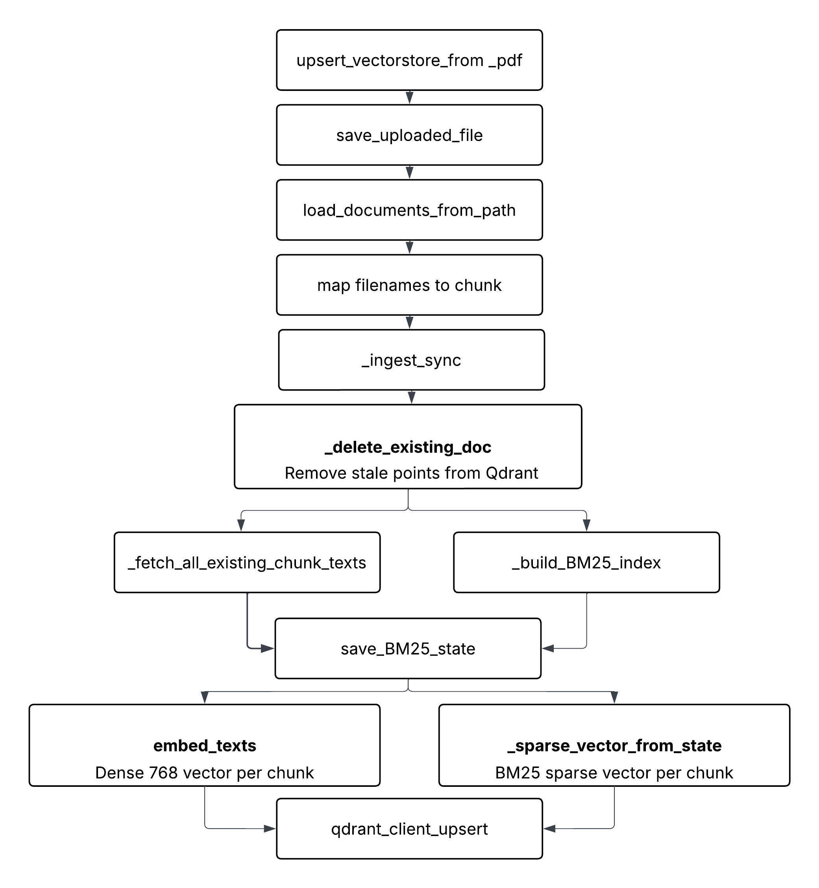
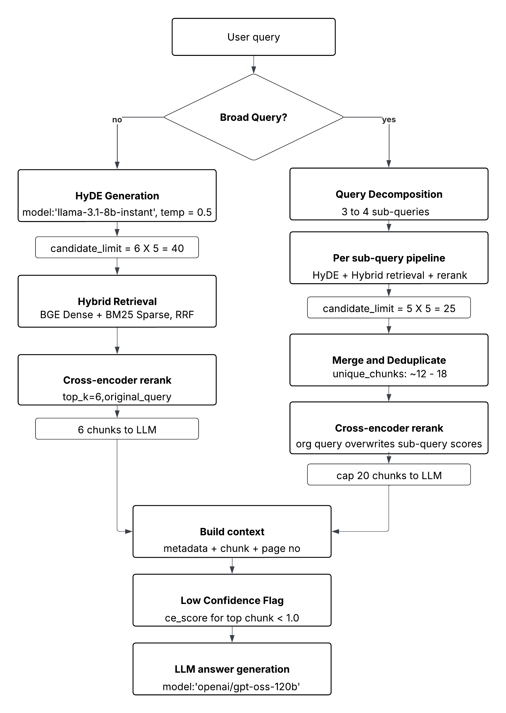

# RAG BOT - Server

This is the FastAPI backend for the RAG PDFBot. It handles PDF processing, vectorstore embedding, LLM chain execution, and API endpoints.

---

## Project Structure

```
server/
├── api/                        # FastAPI routes and schemas
├── config/                     # Environment and constants
├── core/                       # LLM logic, vectorstore, processing
├── utils/                      # Logger and helpers
├── main.py                     # App entry point
```

---

## Installation

1. **Clone the repo**

```bash
git clone https://github.com/Srivatsanray/rag-bot/
cd rag-bot
```

2. **Create a virtual environment (optional)**

```bash
python3 -m venv venv
source venv/bin/activate
```

3. **Install dependencies**

```bash
cd server

pip3 install -r requirements.txt
```

---

## Usage

Run the app:

```bash
cd rag-bot/server

uvicorn main:app --reload
```

---

## API Endpoints

- `/upload`
- `/chat`
- `/vector_store/count/`
- `/vector_store/search`
- `/health`

---
# Core

## Chunking

Uploaded PDFs are parsed page-by-page using `pymupdf4llm`, which converts page to markdown. We use a parser to attach each chunk with source filename, page number, section topic (nearest preceding heading), and block type.

Paragraph blocks are split using overlapping fixed-chunk (~409 words,~103 word overlap). Chunk boundaries are snapped to sentence edges so every chunk starts and ends at a complete sentence. Tables and codes are stored as a single chunk.

```
│◄────── words_per_chunk (~409) ──────►│
│                                       │
start ─────────────────────────── raw_end
                                    │
                          snap back to sentence end
                                    │
                                   end  ← actual chunk end
│◄─── chunk_text ──────────────────►│
                        │◄ overlap (~103) ►│
                        raw_next          end
                            │
                   snap forward to sentence start
                            │
                         new start
```

## Vectorstore Flowchart

<p align="center">

</p>

## Retrieval + LLM Generation

Implemented query routing use keyword heuristic to classify broad or narrow query. The decision pipeline is as follows:

**Narrow queries** use single-pass HyDE retrieval: a small LLM (`llama-3.1-8b-instant`) generates a short hypothetical passage that would answer the query, and that passage is used as the embedding vector for retrieval. The retrieved chunk is again cross-encoded with the original query for reranking.

**Broad queries** use multi-query retrieval: the query is first decomposed into 3–4 focused sub-queries, each targeting a distinct sub-topic. HyDE runs independently for each sub-query, and the resulting candidate pools are merged and deduplicated.


The cross-encoder score also drives the low-confidence flag: if the top chunkscores below a threshold, the response is flagged and a warning is shown in the UI. The resulting chunks are prompted to the answering model (`openai/gpt-oss-120b`) instructed to cite every claim by passage number.

<p align="center">

</p>

---
## Logging

Logs are printed to the console and controlled via `utils/logger.py`.

---
